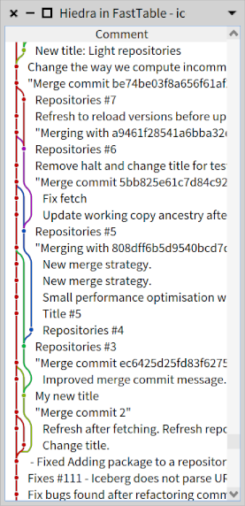
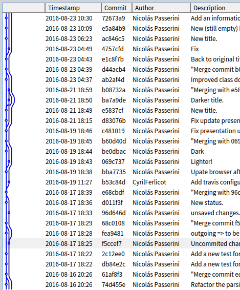

# Hiedra [](http://travis-ci.org/tinchodias/hiedra)

Render a column that visually connects a list of items in a format that's commonly used for VCS commits. Implemented in Pharo, it uses Athens, and provides support for Morphic, FastTable, Spec and Spec2.


## Screenshots

Text and hiedra in the same column (the text sticks to the hiedra on each row):



Multiple columns, dark theme:



## Install it

Note this project is already part of Pharo 6, 7, 8 and 9-dev. But if you need to install it, the script is:

```Smalltalk
		Metacello new 
			repository: 'github://tinchodias/hiedra/src';
			baseline: 'Hiedra';
			load.
```

:warning:
The [Pharo repository](https://github.com/pharo-project/pharo) might have a more recent version of this project, as the code is embedded (it's not maintained as an external project).
:warning:


## Use it

You can find the classes named `HiFastTableExample` and `HiSpecExample` with executable examples (class-side).

## License

The code is licensed under [MIT](LICENSE).

## What's *hiedra*?

It's the name in Spanish of [this plant](https://en.wikipedia.org/wiki/Hedera).
