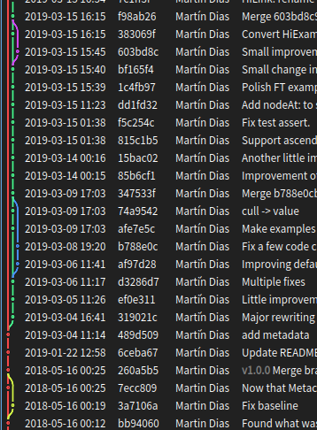

# Hiedra [](http://travis-ci.org/tinchodias/hiedra)

It is a small Pharo project to visually connect items in a history-like graph. It uses Athens, and provides support for Morphic, FastTable and Spec.

White theme and single column (the text sticks to the hiedra on each row):


Dark theme and two columns:



## Install it

Note this project is already part of Pharo 6, 7, 8 and 9-dev. But if you need to install it, the script is:

```Smalltalk
		Metacello new 
			repository: 'github://tinchodias/hiedra/src';
			baseline: 'Hiedra';
			load.
```

:warning:
The [Pharo repository](https://github.com/pharo-project/pharo) might have a more recent version of this project, as the code is embedded (it's not maintained as an external project).
:warning:


## Use it

You can find the classes named `HiFastTableExample` and `HiSpecExample` with executable examples (class-side).
